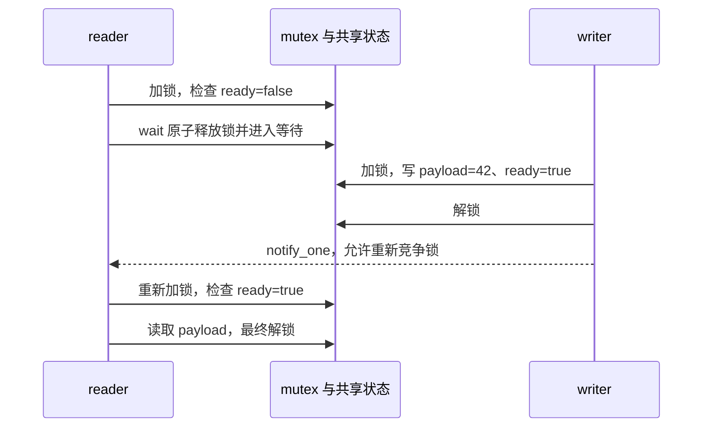

# L05｜mutex、条件变量与线程之间的等待（约 4 小时）

你已经写过容器：一个操作可能同时修改指针、元素和 size。多个线程访问同一对象时，需要保护的是这些操作共同维持的状态。本节先用标准同步工具观察机制，再为 L06 的有界阻塞队列做准备。

[observe.cpp](observe.cpp) 已实现下面五组观察，带独立命令和检查。你需要预测输出、读懂同步顺序，再完成各节的变体。本节不提供 L06 队列的核心实现，也不要求先写无锁队列。

读完观察程序后，按 [动手练习](EXERCISES.md) 实现三个小组件：共享统计器、一次性结果、可关闭的资源计数器。[sync_exercises.hpp](sync_exercises.hpp) 只提供接口、状态字段和 TODO；独立检查已提供，共 12 项。先完成这些练习，再进入 L06。

第一次先读第 2/3 节，完成 A1 和 B；第二轮再读 A2、C/D，最后处理 E 的时间预算。每轮只读对应函数，不必一次看完整个文件。

## 1. 材料和学习顺序（约 35 分钟）

先读第 2 节并运行实验 A/B，再按问题定点打开材料。下面的时间不包括把视频和书全部看完。

| 材料 | 具体看什么 | 对应实验 |
|---|---|---|
| [R07：Back to Basics: C++ Concurrency](https://www.youtube.com/watch?v=8rEGu20Uw4g) | 先找 thread lifetime、data race、mutex/RAII locking、condition_variable；atomic 留到 L07 | A/B，选看约 15 分钟 |
| [OSTEP：Condition Variables](https://pages.cs.wisc.edu/~remzi/OSTEP/threads-cv.pdf) | 找等待线程结束、producer/consumer、为什么用 while 检查条件；书中的 pthread API 对照本节 C++ API | B/C/D，选读约 15 分钟 |
| [OSTEP：Locks](https://pages.cs.wisc.edu/~remzi/OSTEP/threads-locks.pdf) | 区分“互斥访问”与“等待条件”；锁的底层实现最后选读 | A |
| [condition_variable 标准契约](https://eel.is/c++draft/thread.condition.condvar) | 搜 `wait`、`wait_until`、`pred`；核对解锁、阻塞、重新加锁及返回值 | B–E，核对约 5 分钟 |
| [项目材料目录](../../docs/RESOURCES.md) | R07/R08/R13 的完整入口 | 查漏补缺 |

标准链接是持续更新的工作草案，本节只使用 C++20 已有接口。OSTEP 的代码是 pthread 示例，不需要照抄它的类型和函数名。

## 2. 先分清四件事

假设一个线程产生整数，另一个线程等到整数准备好再读取：

| 对象 | 本节含义 | 不能混淆的地方 |
|---|---|---|
| `payload` | 真正要传递的数据，例如 42 | 通知不携带这个整数 |
| `ready` | 判断数据是否可以读取的状态；`ready == true` 是谓词 | 条件变量对象本身不保存 ready |
| `mutex` | 让检查、修改 ready/payload 的临界区互斥，并建立同步关系 | 只锁 writer、不锁 reader 不能保护这份共享状态 |
| `condition_variable` | 条件不满足时，让线程释放锁并等待，随后重新检查 | `notify` 不会替你加锁，也不会修改 ready |

还会遇到这些接口：

| 接口 | 作用 |
|---|---|
| `std::jthread worker(function)` | 创建线程执行 function；析构时对仍可 join 的线程请求停止并 join。本例显式 join，线程退出靠程序协议 |
| `worker.join()` | 等待线程完成；返回后可以读取该线程写出的结果 |
| `std::lock_guard lock(mutex)` | 构造时加锁，离开作用域时解锁；适合整个作用域持锁 |
| `std::unique_lock lock(mutex)` | 除自动解锁外，还能显式 unlock/lock；condition_variable::wait 需要它 |
| `std::scoped_lock lock(a, b)` | 同时管理多把锁，使用避免这些锁之间死锁的加锁算法 |
| `lock.owns_lock()` | 当前包装对象是否持有锁，不是查询“是否有其他线程持锁” |
| `std::latch gate(n)` | 一次性倒计时；count_down 减计数，wait 等到计数归零，不会自动重置 |

latch 是观察程序的辅助工具：确保主线程在特定事件之后再继续。例如 reader 已经第一次检查谓词，writer 才开始发布。它不能代替生产/消费过程中的 mutex/CV 协议；本节暂时会用两个操作就够了。latch 计数归零后不要继续 count_down，修改实验事件数量时也要修改相应协调逻辑。

`jthread` 的停止请求不会自动唤醒普通 condition_variable::wait。实验 D 必须修改 closed 并通知，不能仅靠线程对象析构结束等待。参考 [jthread 契约](https://eel.is/c++draft/thread.jthread.class)。

## 3. 编译、分组运行和检查

在项目根目录执行，只构建本节目标：

```sh
cmake --preset debug &&
cmake --build --preset debug --target cv_handshake &&
./build/debug/cv_handshake --locks
```

修改源文件后重新构建。使用 `&&`，防止编译失败后继续运行旧程序。

| 参数 | 源码入口 | 已实现的观察 |
|---|---|---|
| `--locks` | observe_locks() | 两线程递增；两把锁保护相反方向的转移 |
| `--ordering` | observe_ordering() → observe_handshake() | reader 先检查条件、writer 先发布两种顺序 |
| `--notifications` | observe_notifications() | 额外通知后，reader 再次看到条件仍为 false |
| `--consumers` | observe_consumers() | 两个消费者争一份资源，最后关闭并退出 |
| `--timeout` | observe_timeout() | 没有 writer，固定 deadline 到期，谓词仍为 false |
| 无参数或 `--all` | main() | 依次执行 A–E |

第一次逐组运行；最后检查全部：

```sh
./build/debug/cv_handshake --all
ctest --test-dir build/debug \
  -R '^cv_(handshake|locks|ordering|notifications|consumers|timeout)$' \
  --output-on-failure
```

共 6 项 CTest：一个完整入口、五个分组，每项外部超时 10 秒。外部超时负责发现挂死，不是实验 E 的等待 deadline。`--help` 查看参数；非法参数返回 2，检查失败返回 1，通过返回 0。

工作线程不直接打印；主线程在同步或 join 之后输出，减少多线程日志混杂。输出中的谓词检查次数、哪个消费者取得资源、实际耗时可能变化。

## 4. 实验 A：锁保护的是哪些操作（约 20 分钟）

运行 `--locks`。读 observe_locks()，它有两个独立场景。

### A1：两个线程递增同一个整数

每个线程执行 2000 次 `++counter`，整次读-改-写都在同一个 mutex 的保护下。两个线程 join 后检查最终结果：

```text
[A lock_guard] counter=4000 expected=4000
```

`++counter` 对普通 int 不是跨线程的原子操作。把“读取旧值”“计算新值”“写回”画成三个格子，解释为什么两个线程可以覆盖对方的更新。运行现有基线时不会发生这种未同步访问。

你来做：把 iterations 改为 100 或 5000，预测并核对结果；再把 `++counter` 改成一个同时更新“任务数”和“任务总金额”的操作，仍用一把锁保护这两个字段，最后检查它们的关系。

### A2：同时修改两个余额

两个余额初始都是 2000，一个线程向右转移 2000 次，另一个向左转移 2000 次。每次同时持有两把 mutex；源码中两个 scoped_lock 的参数顺序相反。

```text
[A scoped_lock] left=2000 right=2000 total=4000
```

scoped_lock 负责协调多把锁的取得；单次转移必须同时覆盖两个余额。如果改成分别加锁、解锁再修改另一边，其他线程可能看见转移只完成一半的状态。基线没有要求某个线程先执行，也没有测量公平性或性能。

你来做：只在纸上画“线程 1 持有左锁等右锁，线程 2 持有右锁等左锁”的死锁交错；不要把必然死锁版本放进正常 CTest。

完成标准：能说明 RAII 为什么能在离开作用域时解锁；能区分单字段的 data race 与多个字段共同维持的逻辑不变量。互斥关系见 [mutex 要求](https://eel.is/c++draft/thread.mutex.requirements)，多锁管理见 [scoped_lock 契约](https://eel.is/c++draft/thread.lock.scoped)。

## 5. 实验 B：先通知、后等待，为什么也能正确（约 35 分钟）

运行 `--ordering`，先只读 observe_handshake()。状态初始为 `ready=false, payload=0`，发布时在同一把锁下写 `payload=42`、`ready=true`。

reader 使用：

```cpp
condition.wait(lock, [&] {
  return ready;
});
```

谓词版本的含义等价于：

```text
持有 mutex 检查 ready
→ true：直接继续，仍持有锁
→ false：原子地释放 mutex 并进入等待
→ 被唤醒后重新取得 mutex
→ 回到条件检查
```

“原子地释放锁并等待”让遵守同一把锁协议的 writer 不会在检查 false 与进入等待之间插入一次丢失的状态发布。返回前重新加锁可能需要等待其他线程释放 mutex。

下面是 reader-first 的一条允许交错；实际运行也可能多次唤醒、重新检查：



基线强制了以下两种观察顺序：

| 场景 | 实际执行顺序 | 输出应如何理解 |
|---|---|---|
| reader-first | reader 首次检查 ready=false；latch 放行主线程；writer 取得锁后发布并通知 | observed=42，predicate_checks 至少 2 |
| writer-first | 主线程完成发布和通知，然后才创建 reader | 首次检查已经为 true；predicate_checks=1，不进入阻塞 |

典型输出：

```text
[B reader-first] observed=42 predicate_checks=2 lock_on_return=1
[B writer-first] observed=42 predicate_checks=1 lock_on_return=1
```

writer-first 的那次通知没有等待者，通知本身不会保留。但 ready 状态仍然为 true，reader 检查后可以继续。没有谓词的裸 wait 不会自动读取 ready，不能依赖“之前通知过一次”直接返回。

`lock_on_return=1` 表示 wait 返回时 unique_lock 仍持有锁。writer 的解锁与 reader 后续取得同一把锁建立数据可见性关系；reader 写出的 observed/checks 等结果在主线程读取前经过 join。两种同步用途分开解释；writer-first 还有线程创建顺序，本例不用于证明 mutex 是该顺序中唯一的同步来源。

你来做：

1. payload 改成一对关联字段，例如 `sequence=7, doubled=14`；在同一把锁下发布，reader 检查关系。
2. 将 publish() 中的 notify 移入 lock_guard 的作用域，重新运行两种顺序。正确性应保持；被唤醒不代表能立刻取得锁，也不能从一次耗时断言哪个版本更快。
3. 画 reader-first 的锁所有权变化，标出 writer 何时才能进入临界区。

完成标准：能解释为什么这里用 unique_lock、为什么 wait 时释放锁、为什么通知早于等待仍能正确，以及 join 解决哪一次结果读取。

## 6. 实验 C：被通知不等于条件成立（约 25 分钟）

运行 `--notifications`。它把原来那条“额外通知”变成一个可以观察到中间状态的场景：

1. reader 第一次检查 ready=false。
2. 主线程取得 mutex，设置观察标记 probe_requested，发送通知，但不修改 ready。
3. reader 重新取得锁，再次观察 ready=false，通过 false_rechecked 告知主线程，继续等待。
4. 主线程确认 reader 还没有读取 payload，然后发布 42、设置 ready=true，再通知。
5. reader 返回，读取 payload，主线程 join 后检查。

典型输出：

```text
[C extra-notify] ready_before_publish=0 predicate_checks=3 observed=42
```

probe_requested 和两个 latch 是实验仪器，不是传递 payload 的业务条件。谓词检查次数可能大于 3；它不等于通知次数，也不等于实际进入 OS 等待的次数。

这里主动发出了额外通知，不能把它称作“强制制造虚假唤醒”。标准还允许没有对应通知的虚假唤醒；这两种情况都需要重新判断条件。准确的 wait 行为见 [条件变量契约](https://eel.is/c++draft/thread.condition.condvar)。

你来做：读懂观察标记何时置 true、何时恢复 false；解释如果只写 `if (!ready) wait(lock)`，返回后不重新检查，为什么可能读到尚未准备好的数据。把这条错误交错写下来，不把含未同步访问的版本当成正常运行实验。

完成标准：解释“唤醒只是重新检查条件的机会”，并分清通知、多余通知与虚假唤醒。

## 7. 实验 D：两个消费者为什么不能只检查一次（约 30 分钟）

运行 `--consumers`。两个消费者都先检查一次空状态，主线程再放入一份资源并 notify_all。它们使用同一个 mutex、同一个 CV，等待谓词是：

```text
available > 0 || closed
```

谓词成立后仍需区分两种状态：有资源就消费；资源为 0 且 closed 就退出。主线程等到唯一的资源被消费，再置 closed 并 notify_all，最后 join 两个线程。

以下两种结果都正确，不能要求某个线程固定获胜：

```text
[D two-consumers] consumed=[1,0] remaining=0 closed=1
[D two-consumers] consumed=[0,1] remaining=0 closed=1
```

必须成立的是消费次数之和为 1、剩余为 0、两个线程都退出。基线不保证两个线程同时运行，也不强制第二个消费者一定在 close 前重新等待。

解释下面这条允许的交错：

| 时刻 | 消费者 A | 消费者 B | 资源数 |
|---|---|---|---|
| 1 | 等待 | 等待 | 0 |
| 2 | 被 notify_all 唤醒，竞争锁 | 被唤醒，竞争锁 | 1 |
| 3 | 取得锁并消费 | 仍在等待锁 | 0 |
| 4 | 释放锁后继续等待 | 取得锁，发现资源已被拿走 | 0 |

B 真实收到了通知，仍然没有资源可以消费；这不需要发生虚假唤醒。重新检查条件是资源竞争本身的要求。

你来做：只把“放入资源之后”的 notify_all 改成 notify_one，关闭时仍保持 notify_all。核对消费总数与退出语义，解释两种通知影响的是等待者集合，而不是生成多少份资源。不要把资源数直接改成 2 而保留 consumed_one(1)：latch 是一次性的，事件次数改变时必须重新设计协调计数。

完成标准：能画出上面的交错，解释 close 为什么也属于等待谓词、为什么关闭必须唤醒等待者。本例只有一份资源，没有实现 push/pop、容量限制和完整队列接口；这些留到 [L06](../06_bounded_queue/README.md)。

## 8. 实验 E：等待多久，返回值表示什么（约 25 分钟）

运行 `--timeout`。本例故意没有 writer，ready 一直为 false；进入等待前计算一次：

```text
deadline = steady_clock::now() + 30ms
```

随后使用带谓词的 wait_until。典型输出：

```text
[E deadline] satisfied=0 lock_on_return=1 deadline_ms=30 elapsed_ms=30 predicate_checks=2
```

| 字段 | 含义 |
|---|---|
| satisfied | 返回时谓词是否成立；不是“有没有收到通知” |
| lock_on_return | 超时返回时也重新持有 mutex |
| deadline_ms | 从开始到目标截止时间的预算 |
| elapsed_ms | 本次实际耗时，可能因调度、时钟粒度、重新取得锁而更长 |
| predicate_checks | 检查 ready 的次数，不要求固定为 2 |

不对 elapsed_ms 做“必须等于 30”或“必须小于 31”的断言。steady_clock 用于单调时间预算，不使用可能被调整的日历时间来安排本例超时。

注意区分两种写法：

- 手写循环，每次醒来再调用一次**不带谓词的** `wait_for(lock, 30ms)`：每次调用都开始新的相对等待，整体等待可能不断延长。
- **一次调用带谓词的** `wait_for(lock, 30ms, pred)`：它本身使用同一截止时间处理内部重试，不会因为内部重新检查就自动重置全部预算。

因此，固定 deadline 解决的是跨多次等待调用的预算问题，不是说所有 wait_for 都错误。返回值语义见 [wait_until/wait_for 契约](https://eel.is/c++draft/thread.condition.condvar)。

你来做：将 observe_timeout() 中的 budget 从 30ms 改成 10ms 或 100ms，分别记录结果；再在纸上画“20ms 时醒来、再次等 30ms”的相对预算与原始 30ms deadline 的区别。不要用 sleep 保证线程启动顺序；需要发布早于等待等场景时复用实验 B 的协调思路。

完成标准：能解释固定截止时间、谓词返回值、重新持锁和调度延迟。

## 9. 如何验收，再进入 L06（约 30 分钟整理）

先完成 A/B，随后 C/D，最后 E。全部日志通过只表示现成基线运行成功；你还需要交付：

1. 一张共享状态表：哪个字段由哪把锁保护，哪些结果是在 join 后读取。
2. 三条交错：writer 先发布；通知后条件仍不成立；两个消费者争一份资源。
3. 至少两个本节指定变体的代码和结果，保留相关 require，条件改变时同步更新检查。
4. 不看代码解释 lock_guard、unique_lock、scoped_lock 的区别，以及为何 atomic ready 不自动使所有共享状态安全。

动态检查可以使用：

```sh
cmake --preset asan &&
cmake --build --preset asan --target cv_handshake &&
ctest --test-dir build/asan -R '^cv_' --output-on-failure
```

ASan/UBSan 检查已运行路径的内存和部分未定义行为，不能代替竞态检查。Linux 上 TSan 的入口是：

```sh
cmake --preset tsan &&
cmake --build --preset tsan --target cv_handshake &&
ctest --test-dir build/tsan -R '^cv_' --output-on-failure
```

此前你的环境出现过 `ThreadSanitizer: unexpected memory mapping`，并用下面的方式成功运行过所有权检查。如果同一问题再次出现且当前系统允许禁用该进程的 ASLR，可对本节尝试相同方式：

```sh
setarch x86_64 -R ctest --test-dir build/tsan -R '^cv_' --output-on-failure
```

这是该环境的运行时兼容性处理，不是修复竞态；其他平台不要照搬。重复运行成功、日志看起来合理或 sanitizer 未报错，都不能代替锁与等待谓词的交错分析。

2026-10-09 本次验证：Debug、ASan/UBSan 各 6/6 通过；TSan 直接启动仍出现地址映射问题，使用上述 setarch 命令后 6/6 通过。Debug 的 B/C/D 三个分组各重复 30 次通过，格式和命令行参数检查通过。这些记录覆盖现成基线，不代表你修改后的变体已经验证。

完成上述分析和变体，再完成 [动手练习](EXERCISES.md) 的三个组件和 12 项检查后进入 L06。L06 第一版可以用 std::deque 保存元素，重点练空/满等待、close/drain 和线程退出，无需先完成其余手写容器。
